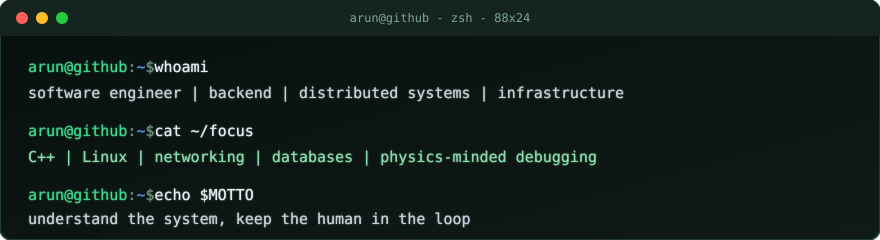
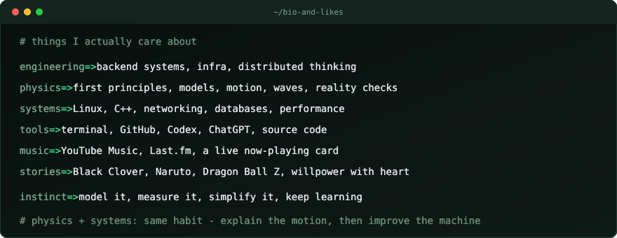
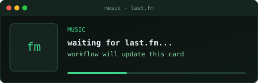

<!--
  Profile README template: terminal edition.
  Colors live in ./assets/*.svg because GitHub strips most inline CSS.
  Dynamic zones: COMMITS and MUSIC marker pairs via scripts/update-readme.mjs.
-->

<p align="left">
  
</p>

<br />


```text
I build backend and distributed systems, but the part I like most is
understanding why things behave the way they do.

That usually pulls me toward C++, Linux, databases, networking, and the
physics mindset: start from first principles, test the model, measure what
reality says, then make the system simpler.

I like honest tools, calm infrastructure, music while working, and stories
about getting stronger without losing kindness. Codex and ChatGPT are part
of that loop for me: thinking partners for slowing down, naming assumptions,
and keeping the work humane.
```

<br />


<p align="left">
  
</p>

<br />


```text
languages   -> C++ | TypeScript | Go | Python
runtime     -> Linux | Node.js
cloud       -> AWS
infra       -> Terraform | CDK | Docker | GitHub Actions
data        -> DynamoDB | MongoDB | ClickHouse | PostgreSQL
systems     -> SQS | Kinesis | Lambda | API Gateway
```

<br />


<!-- COMMITS:START -->
<pre>
<a href="https://github.com/arun-kushwaha04/arun-kushwaha04/commit/dae0b3c40215060e07b789751a244ed7b67405db"><code>dae0b3c</code></a>  update readme                                 <i>arun-kushwaha04/arun-kushwaha04</i>
<a href="https://github.com/arun-kushwaha04/arun-kushwaha04/commit/4884db16d3dd67ae72b872d4ab968aa95139e399"><code>4884db1</code></a>  update readme                                 <i>arun-kushwaha04/arun-kushwaha04</i>
<a href="https://github.com/moov-io/fincen/commit/66d4b613a8e202f5c523391252894a33f8381e01"><code>66d4b61</code></a>  Generate attribuites                          <i>moov-io/fincen</i>
<a href="https://github.com/moov-io/fincen/commit/6254f373c38a002c726e5b0cb0680a14c23c4129"><code>6254f37</code></a>  Update pkg/suspicious_activity/activity.go    <i>moov-io/fincen</i>
<a href="https://github.com/moov-io/fincen/commit/f2e500ad5be4737be7843e2c67ccfc7458b87252"><code>f2e500a</code></a>  Update pkg/suspicious_activity/activity.go    <i>moov-io/fincen</i>
<a href="https://github.com/moov-io/fincen/commit/14f8fe46b015f2454ad500f2d03eebe1d8d28731"><code>14f8fe4</code></a>  feat: Update PartyIdentification validation…  <i>moov-io/fincen</i>
<a href="https://github.com/arun-kushwaha04/go-crud-api/commit/d6394ba919e66dcf3461813050af08a01147257e"><code>d6394ba</code></a>  added endpoints for crud operations           <i>arun-kushwaha04/go-crud-api</i>
</pre>
<!-- COMMITS:END -->

<br />


```text
working on      distributed systems and backend infrastructure
learning        C++ | Linux internals | physics of computation
interested in   databases | runtimes | infra | performance
status          probably tracing one weird edge case
```

<details>
<summary><code>$ ls ~/open-source</code></summary>

```text
linux/
cpp/
distributed-systems/
databases/
developer-tools/
observability/
cloud-infrastructure/
```

</details>

<br />


<!-- MUSIC:START -->
<p align="left">
  
</p>
<!-- MUSIC:END -->

<br />

<!-- Place user-owned/licensed GIF at: assets/asta.gif -->
<p align="center">
  
  <br />
  <code>surpass your limits.</code>
</p>

<br />


```text
understand > memorize
measure    > assume
simple     > clever
debug      > guess

$ echo $STATUS
still learning.

$ _
```
